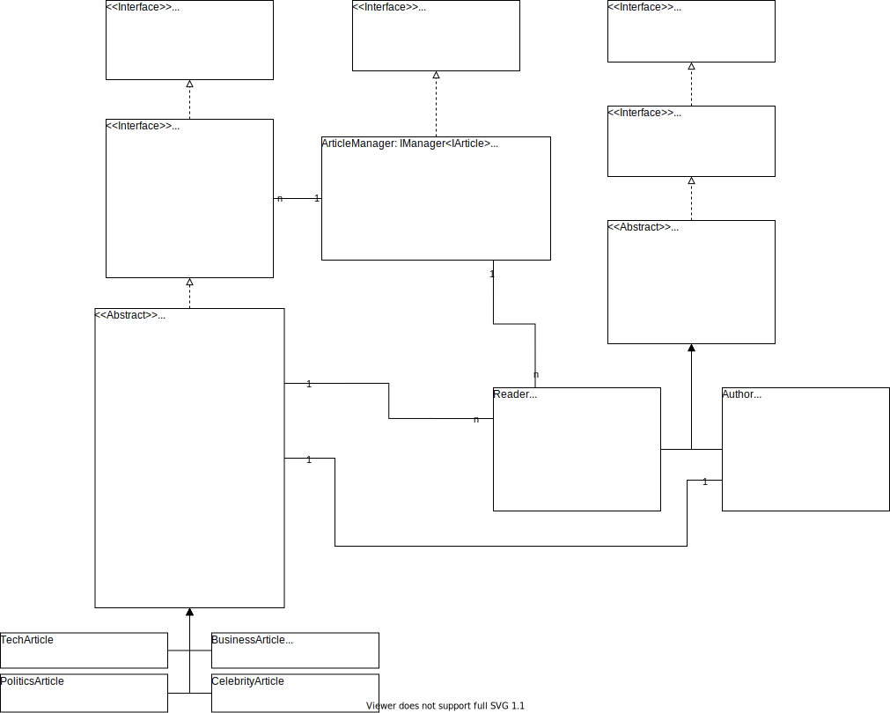

# SharpNews

Ein Projekt welche die Artikel einer News Website darstellt.  
Es gibt Artikel von unterschiedlichen Kategorien wie Technik, Wirtschaft, Politik und Promis.  
Artikeln wird ein Author zugewiesen und die Artikel können:
- erstellt
- bearbeitet
- veröffentlicht werden  

Leser können
- angeben an welchen Kategorien sie interessiert sind 
    - werden informiert, wenn ein neuer Artikel veröffentlicht wird
- Artikel kommentieren

Die Authoren können
- ihnen zugewiesenen Artikel veröffentlichen
    - werden informiert wenn ein neuer Kommentar auf diesen hinterlassen wird

---

## Infrastruktur

---