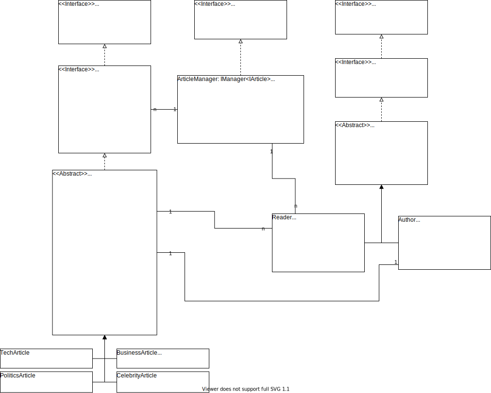

# SharpNews

SDM Projekt 26.10.2022  
Georgios Kitsikoudis

---
## Vision

Ein Projekt welche die Artikel einer News Website darstellt.  
Es gibt Artikel von unterschiedlichen Kategorien wie Technik, Wirtschaft, Politik und Promis.  
Artikeln wird ein Author zugewiesen und die Artikel können:
- erstellt
- bearbeitet
- veröffentlicht werden

Lesende können
- angeben an welchen Kategorien sie interessiert sind 
    - werden informiert, wenn ein neuer Artikel veröffentlicht wird
- Artikel kommentieren

Die Authoren können
- ihnen zugewiesenen Artikel veröffentlichen
    - werden informiert wenn ein neuer Kommentar auf diesen hinterlassen wird  


## Use-Case-Diagramm


<div class="page"/>

## Klassendiagramm



<div class="page"/>

## PAP


PAP als Pseudocode:
```
func Publish(title: string):
    foundArticles: IArticle[]

    for each article in this.articles do:
        if article.title == title do:
            foundArticles.Add(article)

        else:
            continue
    

    switch found.articles.Length
        case 0 do:
            throw Error('no articles with title {title}')
            return
        
        case 1 do:
            article.Publish()
            return
        
        default do:
            throw Error('multiple articles with title {title}')
            return
```

<div class="page"/>

## Pseudocode Testscenario

```
Main()

    Create Factory
        factory

    Create ArticleManager
        manager

    Create Authors
        author1
        author2
        author3

    Create Readers
        reader1 {Interests = [TechArticle, PoliticsArticle]}
        reader2 {Interests = [PoliticsArticle, BusinessArticle, CelebrityArticle]}
        reader3 {Interests = [PoliticsArticle, CelebrityArticle]}

    factory: Create Articles:
        TechArticle {by author1, 'New Intel GPU', 'A750'}
        PoliticsArticle {by author1, 'Brexit', 'Brexit is still bad'}
        BusinessArticle {by author2, 'Apple stocks', '+0.2%'}
        CelebrityArticle {by author2, 'Monkey', 'A monkey did a flip'}
        TechArticle {by author3, 'Linux vs Windows', 'Linux is better'}
        PoliticsArticle {by author3, 'North Korea', 'Kim Jong-Un stinks'}
    Add new Articles to manager

    author1: Publish Articles
        'New Intel GPU'
        'Brexit'
    author2: Publish Articles
        'Apple stocks'
        'Monkey'
    author3: Publish Articles
        'Linux vs Windows'
        'North Korea'

    reader1: Comment
        {'New Intel GPU', 'AMD is better'}
        {'North Korean', 'I agree'}
    reader2: Comment
        {'Apple stocks', 'Oh no i am poor now'}
        {'Monkey', 'No way'}
    reader3: Comment
        {'Monkey', 'So inspirational'}
        {'North Korean', 'Thanks for the info'}
```

Erwarteter Output:
```
> reader1 notified: TechArticle 'New Intel GPU' by author1 published
> reader1 notified: PoliticsArticle 'Brexit' by author1 published
> reader2 notified: PoliticsArticle 'Brexit' by author1 published
> reader3 notified: PoliticsArticle 'Brexit' by author1 published
> reader2 notified: BusinessArticle 'Apple stocks' by author2 published
> reader2 notified: CelebrityArticle 'Monkey' by author2 published
> reader3 notified: CelebrityArticle 'Monkey' by author2 published
> reader1 notified: TechArticle 'Linux vs Windows' by author3 published
> reader1 notified: PoliticsArticle 'NorthKorea' by author3 published
> reader2 notified: PoliticsArticle 'NorthKorea' by author3 published
> reader3 notified: PoliticsArticle 'NorthKorea' by author3 published
> author1 notified: New comment reader1: 'AMD is better' under 'New Interl GPU'
> author3 notified: New comment reader1: 'I agree' under 'North Korea'
> author2 notified: New comment reader2: 'Oh no i am poor now' under 'Apple stocks'
> author2 notified: New comment reader2: 'No way' under 'Monkey'
> author2 notified: New comment reader3: 'So inspirational' under 'Monkey'
> author3 notified: New comment reader3: 'Thanks for the info' under 'North Korea'

```

<div class="page"/>

## Reflexion

In der folgenden Reflexion soll die Bearbeitung des SDM Projekts mit dem gegebenen Titel "SharpNews" betrachtet werden.  
Für die Aufgabe haben wir die Anforderung erhalten ein OOP Projekt zu erstellen in welchem ein Observer- und Factorypattern realisiert werden soll. Dazu sollten wir ein Use-Case- sowie ein Klassendiagramm und ein PAP für einen Algorithmus aus dem Programm erstellen. Einen Testcase soll auch in Form von Pseudocode aus angegeben werden.  
Diese Reflexion verfolgt das Ziel nachzuvollziehen inwiefern dies gelungen ist.

### Ideensuche
Bei der Ideensammlung und -findung gab es leichte Schwierigkeiten. Ich konnte zwar relativ schnell mehrere Ideen zusammentragen, konnte mich jedoch nicht entscheiden da sich die realisierten Prozesse in der Funktionsweise sehr ähneln.  
Zu Beginn sammelte ich Ideen was für ein Projekt man mithilfe eines Observers realisieren könnte.  
Ideen wie ein Kanban-Board in welchem Tasks angelegt werden können und diese von den jeweiligen Asignees bearbeiten werden und sobald der der Zustand von z.B. In Progress auf Done geändert wird, werden Watchers und Reporter informiert.  
Außerdem hatte ich die Idee einen Blog zu realisieren bei welchem die Abonnenten informiert werden sobald ein neuer Post erstellt wird.  
Letzten Endes habe ich mich für eine News Website entschieden, da ich der Meinung war, dass gängige News Apps heutzutage auf eine ähnlich Weise funktionieren und ich mir das Zusammenspiel zwischen Observable und Observer in diesem Use Case gut vorstellen konnte. Daher fiel mir auch die Erstellung des dazugehörigen Use-Case-Diagramms sehr einfach.  
  
### Modellierung
Als ich mich für die News Website entschieden hatte fing ich damit an ein Klassendiagramm zu erstellen.  
Bei der Modellierung hatte ich das Problem, dass ich zu Beginn keinen genauen Überblick über die einzelnen Funktionen der einzelnen Komponenten hatte. Daher bin ich häufiger währrend der Programmierung häufiger vom Modell abgewichen und habe nachträglich Änderungen übernommen.  
Sonst konnte ich Tools wie draw.io effektiv nutzen und schlussendlich ein sehr präzises Klassendiagramm, welches meinen Struktur sehr genau darstellt, erstellen.  
  
### Realisierung
Da mir, wie schon erwähnt, ein festes Modell zu Beginn gefehlt hat war der Realisierungsteil sehr flexibel und spontan aufgebaut.  
Der Workflow war leider nicht besonders gut da ich sehr viel zwischen unterschiedlichen Baustellen hin und her sprigen musste, weil noch keine feste Richtung für das Projekt definiert wurde.  
Da ich C# jedoch relativ gut beherrsche fiel mir die Umsetzung trotzdem nicht all zu schwer, aber als Nebeneffekt des ständigen Wechseln der aktuellen Baustelle ist der Code, den ich letzendlich geschrieben habe, nicht meinen generellen Ansprüchen gerecht geworden und ich denke, dass ich dieses C# Projekt um einiges besser hätte Umsetzen können.  
Trotz all der selbsterbauten Hürden funktioniert der Code trotzdem auch wenn er vielleicht nicht der Effizienteste ist.

### Fazit
Insgesamt bin ich der Meinung, dass das Projekt denoch Erfolgreich war. Aus den präzisen Diagrammen sollte es sehr schlüssig sein die Struktur und Use-Case des Programms zu verstehen und es ist ersichtlich was es erreichen sollte.  
Für mein nächstes Projekt nehme ich mir vor um einiges strukturierter zu arbeiten und erst mit der tatsächlichen Umsetzung anzufangen nachdem ich einen richtigen Plan und eine generelle Übersicht über meine eigenen Gedanken habe.  
Allgemein denke ich, dass es nicht schaden könnte meine Ideen und meinen aktuellen Stand im Arbeitsprozess aufs Papier zu bringen.