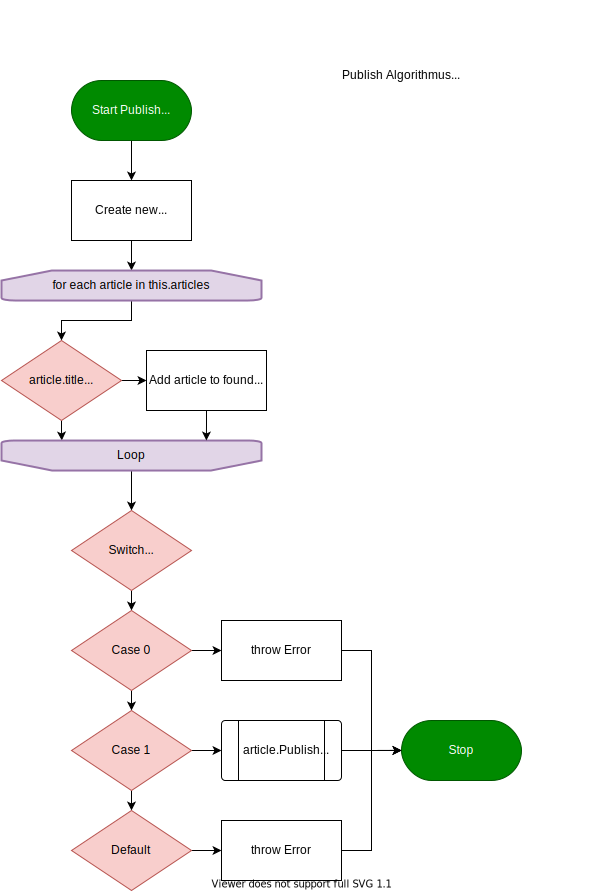

# SharpNews

Ein Projekt welche die Artikel einer News Website darstellt.  
Es gibt Artikel von unterschiedlichen Kategorien wie Technik, Wirtschaft, Politik und Promis.  
Artikeln wird ein Author zugewiesen und die Artikel können:
- erstellt
- bearbeitet
- veröffentlicht werden

Leser können
- angeben an welchen Kategorien sie interessiert sind 
    - werden informiert, wenn ein neuer Artikel veröffentlicht wird
- Artikel kommentieren

Die Authoren können
- ihnen zugewiesenen Artikel veröffentlichen
    - werden informiert wenn ein neuer Kommentar auf diesen hinterlassen wird

---

## Infrastruktur


---

## PAP



---

## Testscenario

```
Main()
{
    ArticleFactory factory
    ArticleManager manager


    // Creating Authors
    Author author1 "Jerry Berry"
    Author author2 "Joe Foe"
    Author author3 "Mark Clark"


    // Creating Readers
    Reader reader1 "iCanRead1" with interests [TechArticle, PoliticsArticle]
    Reader reader2 "iCanRead2" with interests [PoliticsArticle, BusinessArticle, CelebrityArticle]
    Reader reader3 "iCanRead3" with interests [PoliticsArticle, CelebrityArticle]

    manager.AddReaders(reader1, reader2, reader3)


    // Creating Articles
    manager.NewArticle(TechArticle, author1, "New Intel GPU Benchmarks", "A380: 72FPS, A750: 111FPS")
    manager.NewArticle(PoliticsArticle, author1, "What Brexit means for Europe!", "It's bad")

    manager.NewArticle(BusinessArticle, author2, "Apple stock plumits into abyss", "APP -120%")
    manager.NewArticle(CelebrityArticle, author2, "You won't believe what this monkey did!!", "Monkey flip")

    manager.NewArticle(TechArticle, author3, "Why Linux is so much better than Windows", "Just look at it")
    manager.NewArticle(CelebrityArticle, author3, "Johnny Depps wins lawsuit", "Finally")
    manager.NewArticle(PoliticsArticle, author3, "Kim Jong-Un plans new nuclear tests", "Rocketman")


    // Publishing Articles
    author1.Publish("New Intel GPU Benchmarks")

    author2.Publish("Apple stock plumits into abyss")
    author2.Publish("You won't believe what this monkey did!!")

    author3.Publish("Why Linux is so much better than Windows")
    author3.Publish("Kim Jong-Un plans new nuclear tests")


    // Commenting on Articles
    reader1.Comment("New Intel GPU Benchmarks", "NVidia is still better")
    reader1.Comment("Kim Jong-Un plans new nuclear tests", "North Korea is not cool")

    reader2.Comment("Kim Jong-Un plans new nuclear tests", "iCanRead1 I agree")
    reader2.Comment("Apple stock plumits into abyss", "OMG I AM POOR NOW")
    reader2.Comment("You won't believe what this monkey did!!", "No way")

    reader3.Comment("You won't believe what this monkey did!!", "I am about to cry... so inspirational")
    reader3.Comment("Kim Jong-Un plans new nuclear tests", "**chuckle** i'm in danger")
}

Output:

> Reader "iCanRead1" was notified: TechArticle "New Intel GPU Benchmarks" was released by "Jerry Berry"
> Reader "iCanRead2" was notified: BusinessArticle "Apple stock plumits into abyss" was released by "Joe Foe"
> Reader "iCanRead2" was notified: CelebrityArticle "You won't believe what this monkey did!!" was released by "Joe Foe"
> Reader "iCanRead3" was notified: CelebrityArticle "You won't believe what this monkey did!!" was released by "Joe Foe"
> Reader "iCanRead1" was notified: TechArticle "Why Linux is so much better than Windows" was released by "Mark Clark"
> Reader "iCanRead1" was notified: PoliticsArticle "Kim Jong-Un plans new nuclear tests" was released by "Mark Clark"
> Reader "iCanRead1" was notified: PoliticsArticle "Kim Jong-Un plans new nuclear tests" was released by "Mark Clark"
> Reader "iCanRead1" was notified: PoliticsArticle "Kim Jong-Un plans new nuclear tests" was released by "Mark Clark"
> Author "Jerry Berry" was notified: New comment "iCanRead1: NVidia is still better" under "New Intel GPU Benchmarks"
> Author "Mark Clark" was notified: New comment "iCanRead1: North Korea is not cool" under "Kim Jong-Un plans new nuclear tests"
> Author "Mark Clark" was notified: New comment "iCanRead2: iCanRead1 I agree" under "Kim Jong-Un plans new nuclear tests"
> Author "Joe Foe" was notified: New comment "iCanRead2: OMG I AM POOR NOW" under "Apple stock plumits into abyss"
> Author "Joe Foe" was notified: New comment "iCanRead2: No way" under "You won't believe what this monkey did!!"
> Author "Joe Foe" was notified: New comment "iCanRead3: I am about to cry... so inspirational" under "You won't believe what this monkey did!!"
> Author "Mark Clark" was notified: New comment "iCanRead3: **chuckle** i'm in danger" under "Kim Jong-Un plans new nuclear tests"

```